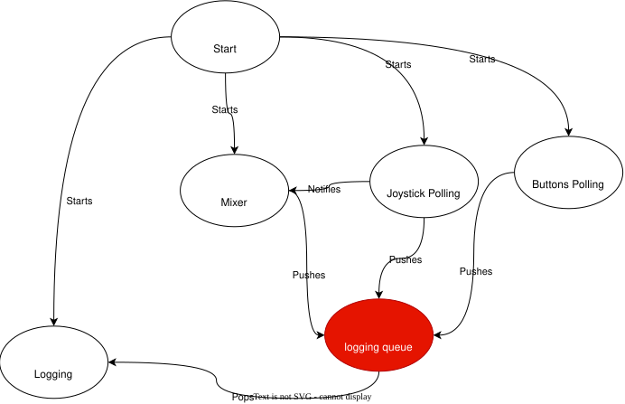
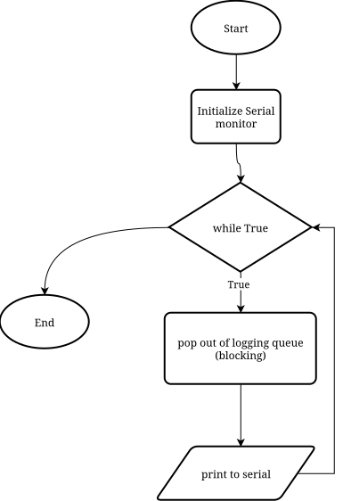
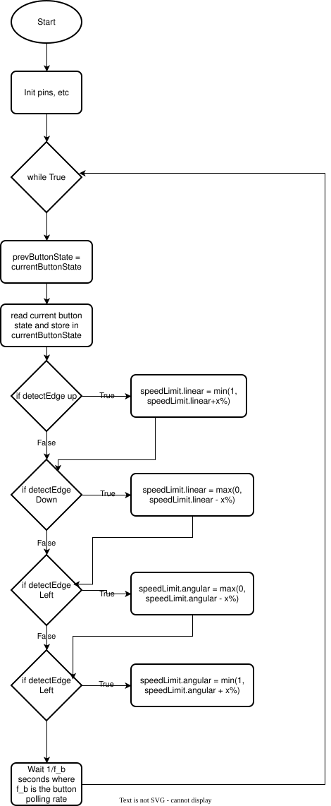
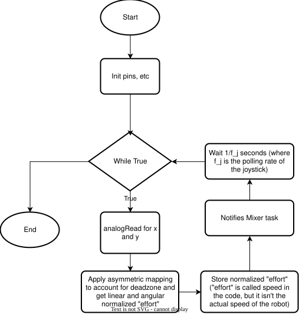

# TODO

- [x] removed unused library and test for regression
- [x] write approximate methods to control $v$ and $\dot{\theta}$
~~- [] measure button bounce back and measure it~~
~~- [] investigate why left and right button aren't responsive for interrupts~~
- [x] approximate that the motor's speed is approximately proportional to the motor speed
- [x] figure out the motor's deadzone through experimental means
- [x] find optimal joystick deadzone
- [x] use RTOS create tasks that handle polling, and writing commands to motors, and logging to the serial terminal
- [x] turn it into a library
- [x] draw flowchart
- [x] format code

# compiling and uploading

We can upload to the esp32 by doing:

```
./upload ./robotControlCar /dev/ttyUSB0
```

# Video showcase

Video showcase linked [here](https://youtu.be/Tbo7F8ZeImc?si=WwJZ_EsBcvtItY92):

[](https://youtu.be/Tbo7F8ZeImc?si=WwJZ_EsBcvtItY92)

# Flowchart

Since the program has many tasks running concurrently, we need to draw multiple flowcharts.



We first start the logging task. More about the logging task is written [here](../docs/logging.md).



We then start the mixer task. More about the mixing mechanics is written [here](../docs/mixer.md).

.svg)

We then start button task:



Then we start the joystick task:



# Joystick

The joystick ADC will range from `adc_min` to `adc_mid - (adc_max - adc_min) * deadzone` which maps to $[-1, 0]$.

And then we do something similar for $[0, 1]$

From there, we can just linearly map this to an internal variable normalized variable called "speed" or something, that is normalized such that 0 means stop, 1 means full speed, and anywhere in between is approximately linearly interpolating between the speeds. We can also make the end point adjustable.

We want one for linear speed, and one for angular velocity.

# Motors

We will do a similar mapping from speed going from `[0, 1]` to `[deadzone * (1 << resolution),1 << resolution]` and similarly for the reversed direction.

# Buttons

Buttons were first handled using an interrupt with a debounce task to deal with switch bouncing, however, the left and right buttons were unresponsive. As such, button polling was used (which runs asynchronously from the joystick)

# Deadzone mapping and remapping

The deadzone remapping is done using a pure function which was defined as `asymMap`. `asymMap` requires a `minLeft, maxLeft and minRight, maxRight, raw` and spits out a scalar called `scaled` between `-1` and `1` (this will be used for joystick ADC to actual motor commands)

There's however, some trouble that must be solved when we need to invert it. Essentially, for `asymMap`, normally, it would be like:

- `[minLeft, maxLeft]` -> `[-1, 0]`
- and `[maxLeft, minRight]` -> 0
- and `[minRight, maxRight` -> `[0, 1]`

When we invert it however:

- `[minRight, maxRight] -> [0, -1]`
- middle is same
- `[minLeft, maxLeft] -> [1, 0]`

So I guess the easiest way is to flip the sign of the mapped output?

Now, I guess we could say it's the same for `invAsymMap`.

# Sign convention

For normal hobby RC, the sign convention is as such:

```
y+
^
|
---> x+
```

So, it's kinda interesting, because, if look at the x-y plane of the drone, normal mapping without sign change would mean that (let's say that this is the left stick) positive $\dot{\theta}$ is CW, which isn't the common mathematical convention. I think it's best to use the normal mathematical sign convention, meaning that we must flip it.

# Information propagation

So essentially, `mixer.h` should be its own isolated file that doesn't depend on `rc.h` because we should be able to use it in other projects too, like, for remote controlled robot or bluetooth controlled robot.

As such, the internal struct `speedLimit` and `speed` should belong to `mixer.h`.

Now, there's a problem of race conditions. As such, we should have mutexes that protect both `speedLimit` and `speed`.

There are also two architectures for notifying to update the motors.

- We can have a separate motor task that independently reads `speed` and updates it accordingly
- We can have a motor task that waits until a task notifies that it has updated the speed variable, and then have the motor task run, of course, with mutex for protection just in case.

I know that in cleanflight, we have a separate IMU task, and a separate PID task that can run at different frequencies, and I guess the PID task's frequency would then need to be synchronized to the mixer task, and also motor command task, which means notification is a better architecture?

The cool thing about the notification architecture is that we can easily turn it into a separate asynchronous task which operates at its own frequency by simply having a task that notifies that task every fixed period.

Also, this means that our tasks should be started in the following order:

- logging task
- mixer task
- rc task

For it to behave nicely while everything is starting. It's no wonder why `systemd` is so complicated because of this problem of "start up dependency".
