# TODO

- [] make the queue sizes configurable in `config.h`
- [x] refactor logging across multiple
- [x] simplify the decision tree for the IR remote
- [] write the flowchart
- [] rename some variables

The complete RTOS tasks necessary for this lab include:

- logging task
- mixer task
- NEC decoder task
- NEC RC task

How the tasks interact with one another is described here:

# NEC driver

So it seems like this is the architecture that's the simplest:

- we have an edge detector ISR that records every edge into a queue
- we have a decoder state machine that normally transitions every time we take from the queue, however, if it takes too long to take from the queue, we transition back to the idle state. 
- There's also some additional counters that keep track of whether it's a repeat code, or whether there's a complete frame.
- after we get a repeat code or a complete frame, we just push that into another queue for consumers to decide what to do with that information.

an approximate NEC decoder state machine looks something like this:

The model runs everytime we detect an edge, but there's also an external timeout (through the queue) that essentially resets the state back to idle if it takes more than around 30ms because no pulse in the NEC protocol lasts more than around 10ms. This will also be where we can decide whether what we have is a repeat code.

The NEC RC task will be the consumer of the NEC decoder task's output and decide what to do with it according to this flowchart:

# IR Remote command mapping

0: FF9867
1: FFA25D
2: FF629D
3: FFE21D
4: FF22DD
5: FF02FD
6: FFC23D
7: FFE01F
8: FFA857
9: FF906F
