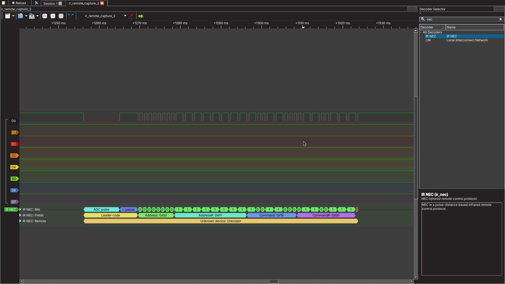

# TODO

- [] make the queue sizes and the size of RAM the task occupies configurable in `config.h`
- [x] refactor logging across multiple
- [x] simplify the decision tree for the IR remote
- [x] write the flowchart
- [] rename some variables

# Video showcase

[youtube video is linked here](https://youtu.be/urIEjEWMWU8?si=cFa0P5YyA2krMA1H).

# RTOS tasks list

The complete RTOS tasks necessary for this lab include:

- logging task
- mixer task
- NEC decoder task
- NEC RC task

How the tasks interact with one another is described here:

The mixer task and the logging task is the same as lab 1. Further explanation and a rough flowchart of those tasks are written here:

- [mixer task explanation](../docs/mixer.md)
- [logging task explanation](../docs/logging.md)

> [!NOTE]
> the application of the speed limit is done in the mixer task, which was already implemented in lab 1

# NEC decoder

I've decided to write a custom NEC decoder because the IRremote library included many more protocols alongside with the NEC protocol, while the NEC protocol itself is quite simple, and can be implemented with a state machine. Moreover, the IRremote library uses a polling API, while we can leverage interrupts and RTOS tasks to take the load off the CPU. 

To decode the signal and find the timings, I used a logic analyzer to analyze the signal. The capture of a frame can be seen here:

The NEC protocol sends 32 bits of data, where 0 or 1 is encoded based on varying pulse periods. There are also some initialization protocol at the start such as the AGC pulse and the pause which we will use in our detection of whether there might be an NEC packet incoming.

The architecture that we use is as follows:

- we have an edge detector ISR that records every edge on the IR receiver pin into a queue
- we have a decoder state machine that normally transitions every time we pop an element off of the blocking concurrent-safe queue, however, if it takes too long to take from the queue, we transition back to the idle state (we start from the idle state)
- There's also some additional counters that keep track of whether it's a repeat code, or whether there's a complete frame.
- after we get a repeat code or a complete frame, we just push that into another queue for consumer tasks to decide what to do with that information.

an approximate NEC decoder state machine looks something like this:

The model runs every time we detect an edge, but there's also an external timeout (through the queue) that essentially resets the state back to idle if it takes more than around 30ms because no pulse in the NEC protocol lasts more than around 10ms. This will also be where we can decide whether what we have is a repeat code.

# NEC RC task

The important behavior that we have currently is that:

- when we press and hold the LEFT, RIGHT, UP, or DOWN button, the robot move accordingly
- when we release it, the robot stops

This is opposed to something like:

- when we press the LEFT, RIGHT, UP or DOWN button, make the robot move
- when we release it, do nothing
- when we press the STOP button, then command the robot to STOP

We choose the first behavior because I think it's a safer method to control the robot (because IR remote protocols aren't very long range, nor reliable), that is, whenever we lose the remote's repeat code signal, force stop the robot.

To do this, we rely on the fact that when we hold a button on a generic IR remote, a repeat code gets sent periodically (which I measured to be at maximum around 100ms), therefore, we can say that when we receive a repeat code, within some threshold, we do nothing, however, when we don't get the repeat code within that threshold time frame, then we shut the motors down automatically.

The NEC RC task will be the consumer of the NEC decoder task's output and decide what to do with it according to this flowchart:

